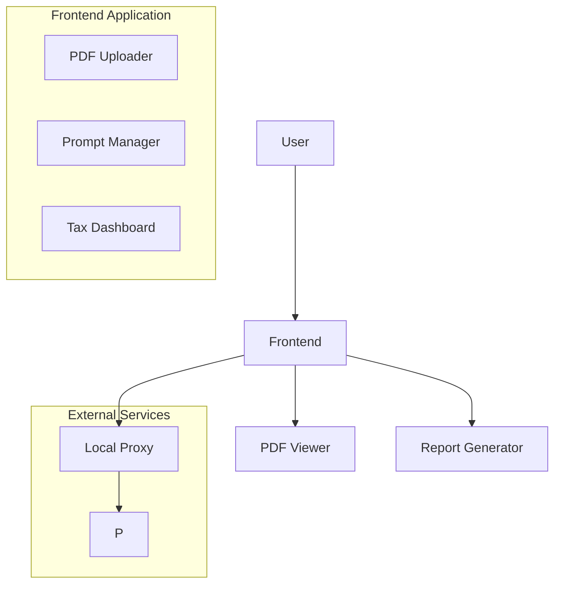

# Tax Corporate Smart Architecture Report

## System Overview

## Key Architectural Decisions

### 1. Environment Configuration ([ADR-0001](/docs/adr/0001-env-configuration.md))
- Secure API key handling through Vite env variables
- Clear separation between development and production modes
- Single .env file for simplicity

### 2. Build Optimization ([ADR-0002](/docs/adr/0002-build-optimization.md))
- Production-specific optimizations:
  - Minification
  - Code splitting
  - Tree shaking
- Development mode preserves:
  - Source maps
  - Fast rebuilds

### 3. PDF Handling ([ADR-0003](/docs/adr/0003-pdf-viewer-strategy.md))
- Native browser PDF rendering
- Strict validation:
  - Magic number check
  - Minimum size enforcement
- Download fallback for invalid files

### 4. Prompt Management ([ADR-0004](/docs/adr/0004-prompt-management.md))
- localStorage persistence for custom prompts
- Admin interface for management
- Clear user feedback system
- Default prompt fallback

### 5. Deployment Strategy ([ADR-0005](/docs/adr/0005-netlify-config.md))
- Netlify-specific configuration:
  - MIME type headers
  - SPA routing
  - Proxy setup
- Asset handling:
  - Explicit copy
  - No inlining

### 6. Error Handling ([ADR-0006](/docs/adr/0006-error-handling.md))
- Structured error classification
- User-friendly messaging
- Comprehensive logging
- Graceful fallbacks

## Cross-Cutting Concerns
- Security: API keys, input validation
- Performance: Bundle optimization
- Maintainability: Clear ADRs, logging
- Usability: Error handling, feedback
