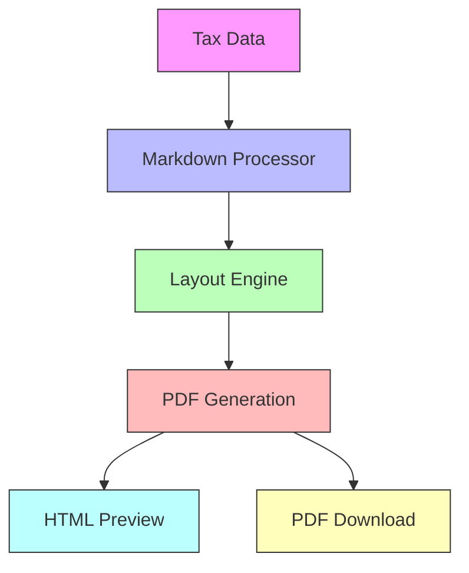

# PDF Generation Flow

## Components
- **Markdown Processor**: Converts raw content to structured sections
- **Layout Engine**: Calculates spacing and page breaks
- **PDF Generation**: Creates PDF document using pdf-lib
- **Outputs**: Interactive HTML preview and downloadable PDF
